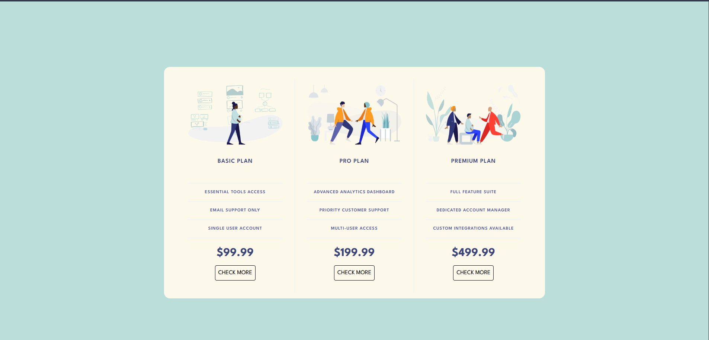
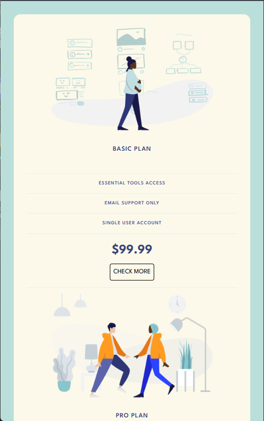

# 💸 Responsive Pricing Panel

A **responsive pricing panel** built using **HTML** and **CSS**, designed to showcase different pricing plans (Basic, Pro, and Premium) in a clean and modern layout.  
This project demonstrates how to structure pricing cards and make them fully responsive across devices — from desktop to mobile.

---

## 🖼️ Preview

### 💻 Desktop View

### 📱 Mobile View

---

## 🧩 Features
- Fully responsive layout using **Flexbox**
- Clean and modern design
- Simple, easy-to-customize HTML structure
- Lightweight, no frameworks used

---

## 🛠️ Technologies Used
- **HTML5**
- **CSS3**
- **Google Fonts (League Spartan)**

---
